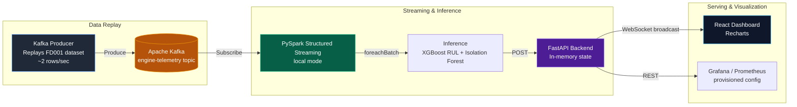

<div align="center">
  
  <h1>VANGUARD</h1>
  <p><strong>Industrial IoT Analytics Pipeline</strong></p>
  <p>Kafka · PySpark Structured Streaming · XGBoost · FastAPI · React</p>
  <p>
    
    
    
    
    
  </p>
</div>

---

## Overview

Vanguard is an end-to-end **Industrial IoT (IIoT) analytics pipeline** that simulates, streams, and analyzes turbofan engine telemetry data in real time.

The system uses the **NASA CMAPSS FD001** benchmark dataset — 100 engine units, each with 21 sensor channels — as its data source. A Kafka producer replays the dataset row by row into a PySpark Structured Streaming job, which runs **Remaining Useful Life (RUL) regression** and **anomaly detection** on every micro-batch, then pushes results to a FastAPI backend that serves a React operator dashboard over WebSockets.

This project is a **local, single-node prototype** built for learning and demonstration of end-to-end MLOps and streaming pipeline patterns.

---

## System Architecture



---

## Core Components

### 1. Telemetry Simulator — `src/kafka_producer.py`
Reads the raw `test_FD001.txt` file line by line and publishes each row as a JSON event to the `engine-telemetry` Kafka topic. A `time.sleep(0.5)` between rows throttles throughput to approximately **2 messages per second** so the downstream pipeline can be observed in real time.

### 2. Data Preprocessing — `src/diagnosis.py`
Processes `train_FD001.txt` into model-ready features:
- Drops seven low-variance sensors and operating settings columns.
- Adds per-engine **expanding mean** and **20-cycle rolling standard deviation** for each remaining sensor.
- Computes and caps RUL labels at **125 cycles**.
- Fits a `MinMaxScaler` and saves both the processed CSV and the scaler artifact.

### 3. Model Training

#### RUL Regression — `src/retrain_xgboost.py`
Trains an **XGBoost regressor** (250 estimators, depth 3) on the processed training data. Sample weights up-weight critical low-RUL windows (RUL < 30 → ×5, RUL < 15 → ×10) to improve near-failure prediction accuracy. The model is saved to `models/rul_regressor.joblib`.

#### Anomaly Detection — `src/train_anomaly_models.py`
Trains two anomaly detection models on the training data:
- **LSTM Autoencoder** (PyTorch, 20 epochs, hidden dim 64): A sequence reconstruction model trained on the first 6,000 rows. A 95th-percentile MSE threshold is computed. Saved to `models/anomaly_detector_ae.pth`. *(This model is not used in the live streaming pipeline.)*
- **Isolation Forest** (scikit-learn, 100 estimators, 5% contamination): Trained on the first 10,000 rows. Saved to `models/anomaly_detector_if.joblib`. **This is the model used in the streaming pipeline.**

### 4. PySpark Streaming Pipeline — `src/spark_streaming.py`
Runs in `local[*]` mode on a single machine. For each micro-batch:
1. Converts Kafka messages to a Pandas DataFrame.
2. Renames columns and builds feature stubs (rolling mean = current value, rolling std = 0, since only one row is available per streaming event).
3. Scales features with the saved scaler, then runs **XGBoost RUL prediction**.
4. Runs **Isolation Forest anomaly detection** (scores normalised to [0, 1]).
5. POSTs per-engine results to the FastAPI ingest endpoint.

### 5. FastAPI Backend — `src/api/main.py`
An async FastAPI application that:
- Accepts `POST /api/v1/telemetry` from the Spark job and stores the latest record per engine in an **in-memory dictionary**.
- Broadcasts every new reading to all connected WebSocket clients at `/ws/telemetry`.
- Exposes `GET /api/v1/engines` to retrieve the latest snapshot for all engine units.
- On WebSocket connect, immediately sends the full fleet snapshot so the dashboard is not blank on first load.

### 6. Operator Dashboard — `dashboard/frontend/`
A Create React App frontend (React 18, Recharts, Lucide icons) that connects to the `/ws/telemetry` WebSocket endpoint and renders engine health metrics in real time. Grafana provisioning config is also included under `dashboard/grafana/`.

### 7. Offline Evaluation — `src/evaluate.py`
A standalone script that evaluates the trained model against the FD001 test set:
- Engineers rolling features on `test_FD001.txt`, aligns to the training schema, and scales.
- Selects the **last recorded cycle** of each engine for prediction.
- Reports **RMSE**, **NASA asymmetric scoring function** (penalises late predictions more heavily), mean/std error, and early/late prediction counts.

---

## Quickstart

### Prerequisites
- Docker & Docker Compose
- Python 3.9+
- Java 11+ (required by PySpark)
- Node.js 16+ (for the React frontend)

### 1. Clone and set up the Python environment

```bash
git clone https://github.com/pxrxshoth/vanguard.git
cd vanguard

# Activate the bundled virtual environment
# Windows
.\vangaurd\Scripts\activate
# Linux / macOS
source ./vangaurd/bin/activate

pip install -r requirements.txt
```

### 2. Start Kafka (via Docker)

```bash
docker-compose up -d
```

### 3. Preprocess data and train models

```bash
# Preprocess raw FD001 data and fit the scaler
python src/diagnosis.py

# Train the XGBoost RUL regressor
python src/retrain_xgboost.py

# Train the LSTM Autoencoder and Isolation Forest
python src/train_anomaly_models.py
```

### 4. Run the streaming pipeline

```bash
# Terminal 1 — FastAPI backend
uvicorn src.api.main:app --reload --host 0.0.0.0 --port 8000

# Terminal 2 — PySpark Structured Streaming job
python src/spark_streaming.py

# Terminal 3 — Kafka producer (replays dataset at ~2 rows/sec)
python src/kafka_producer.py
```

### 5. Start the React dashboard

```bash
cd dashboard/frontend
npm install
npm start
```

The dashboard will be available at `http://localhost:3000`.

### 6. Run offline evaluation

```bash
python src/evaluate.py
```

Prints a formatted report with RMSE and NASA score against the FD001 ground-truth RUL labels.

---

## Dataset

This project uses the **NASA CMAPSS Turbofan Engine Degradation Simulation Dataset (FD001 subset)**, available publicly from the [NASA Prognostics Data Repository](https://www.nasa.gov/intelligent-systems-division/discovery-and-systems-health/pcoe/pcoe-data-set-repository/).

- **Training set**: 100 engine run-to-failure trajectories, 21 sensors, 3 operational settings.
- **Test set**: 100 engines with a held-out end point; ground-truth RUL provided in `RUL_FD001.txt`.
- **RUL cap**: Labels are clipped at 125 cycles (piecewise-linear RUL target).

Place the raw files in `data/raw/files/`:
- `train_FD001.txt`
- `test_FD001.txt`
- `RUL_FD001.txt`

---

## Project Structure

```
vanguard/
├── src/
│   ├── diagnosis.py            # Data preprocessing & scaler fitting
│   ├── retrain_xgboost.py      # XGBoost RUL model training
│   ├── train_anomaly_models.py # LSTM AE + Isolation Forest training
│   ├── kafka_producer.py       # Dataset replay → Kafka (~2 rows/sec)
│   ├── spark_streaming.py      # PySpark micro-batch inference
│   ├── evaluate.py             # Offline evaluation (RMSE, NASA score)
│   └── api/
│       └── main.py             # FastAPI + WebSocket backend
├── dashboard/
│   ├── frontend/               # React operator dashboard (CRA)
│   └── grafana/                # Grafana provisioning config
├── data/
│   ├── raw/                    # Raw NASA FD001 files (not committed)
│   └── processed/              # Preprocessed CSVs (generated)
├── models/                     # Saved model artifacts (generated)
├── docker-compose.yaml         # Single-broker Kafka + Zookeeper
└── requirements.txt
```

---

<div align="center">
  <i>Built as a learning project for end-to-end MLOps and streaming pipelines on the NASA CMAPSS dataset.</i>
</div>
